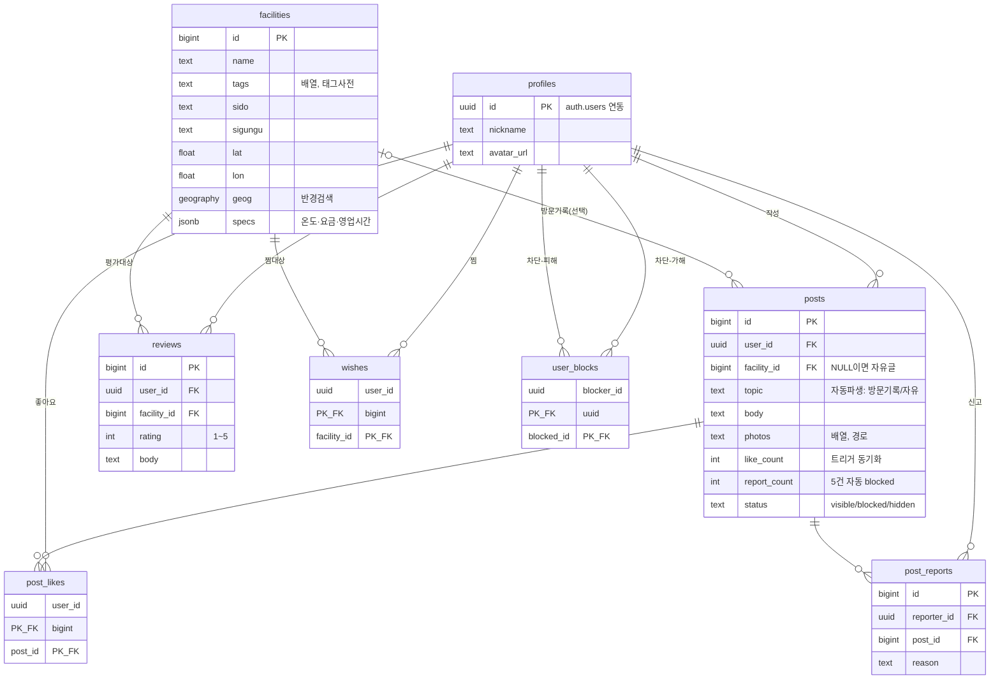

# 스키마 관계도 (ERD)

전체 스키마·정책은 [스키마.md](스키마.md). 아래는 관계 요약(Mermaid).

## 읽는 법
- `||--o{` = 1 : 다 (필수). `|o--o{` = 0또는1 : 다 (선택 — posts.facility_id는 NULL 가능).
- **profiles·facilities = 뼈대**, 나머지는 둘을 가리키는 연결.
- **posts**: facility 있으면 방문기록, 없으면 자유(topic 자동). **reviews**: 별점, 시설 필수, 1인 1시설(`unique(user_id,facility_id)`).
- **복합 PK**(PK_FK): wishes·post_likes·user_blocks는 두 FK 조합이 곧 기본키 → 중복 방지(같은 찜/좋아요/차단 1번).
- **트리거**: 로그인→profiles 생성, 좋아요→like_count, 신고→report_count·자동차단, lat/lon→geog.
